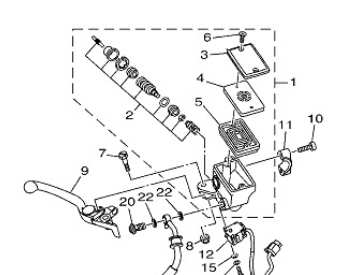
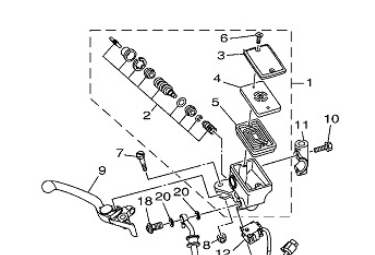

# MT10Mods

The Yamaha FZ-10/MT-10 and MT-10 SP is a bloody good bike. 

There are however certain areas of the bike that can be improved either by a bit of manual labour or simply replacing parts from other bikes.

This repo will try to highlight what the community has done to their bikes.

## Chassis

## Brakes

### Front brake master cylinder upgrades

#### R1 upgrade
It is possible to replace the master cylinder and lever from an R1/R1M 2015.

The standard MT-10 needs a new mirror fitting because the mirror is fitted to the reservoir itself.

The MT-10 SP has a different reservoir with no mirror attachment, as the attachment is fitted to the bracket.

Notice difference in part 11 below.

**MT-10**

**MT-10 SP**

You will need a way to fit a brake fluid reservoir. Some use Brembo kits, some use different methods.

### Front brake calipers

MT-10 owners can upgrade to R1/R1M calipers directly.

MT-10 SP owners would look at Brembos. But it looks like Brembos would need spacers/different brake discs.

#### Brembo RCS 19 upgrade
This fine piece of kit fits the bike brilliantly. However there needs to be done work for the brake switch/cruise control.

## Electronic

### 12v outlet
The standard outlet is quite shoddy on keeping adapters in place because of the horizontal placement.

Author of repo fitted an elastic band around the assembly by loosening a screw.

Other bike owners have fitted dedicated USB outputs, some even show voltage.

## Wheels

# Notes

Neither the author of this repo, nor the rest of it's contributors takes any responsibility for anything. 