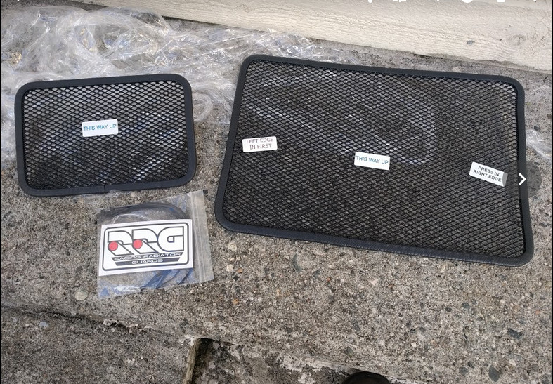
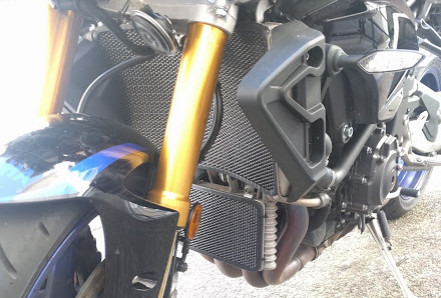
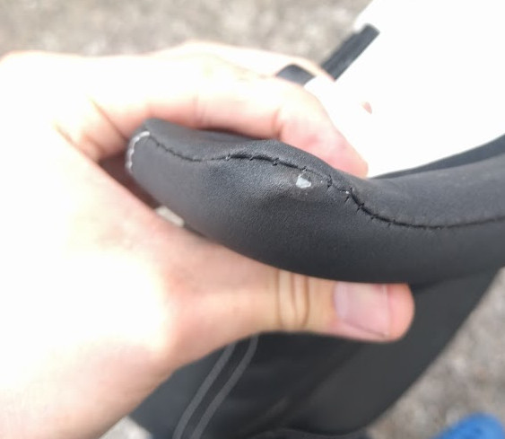

# MT10Mods

The Yamaha FZ-10/MT-10 and MT-10 SP is a bloody good bike. 

There are however certain areas of the bike that can be improved either by a bit of manual labour or simply replacing parts from other bikes.

This repo will try to highlight what the community has done to their bikes.

## Engine

### Radiator and oil cooler protection

One of the first mod often recommended is to further protect the radiator and oil cooler. Being set directly behind the front wheel they are often victims of rocks, dirt, bees and other small furry creatures.

There are many different manufacturers that create protectors. R&G, Evotech, Yamaha OEM parts to name a few.

The author of this repo purchased Racing Radiator Guards which do not require any nuts or bolts to install. This install cost around £35, comapred to £200 from Yamaha OEM.

### R1/R1M Titanium Headers (NOT R1S)

The R1/R1M is delivered with titanium headers as standard while the MT-10 has stainless steel. Buying a brand new pair of headers from Akrapovic or other manufactureres can cost upwards of and over $1000. Second hand headers can be found for as low as $200. Author of this repo bought a full exhaust from an R1 for $300 including shipping. (This included the cat and muffler).

**Note:** Some eBay lists headers as 2015-2018 R1/R1S/R1M without specifying which model they actually came from. Before buying make sure that you are getting headers from either an R1 or R1M. **The R1S has stainless steel headers!**

Steve L. from the MT-10 SP Facebook group has this to say about mounting new headers:

> For the R1 headers. Remove all mounting bolts from the oil cooler so you can move it forwards and down. Then remove the mounting bracket from the front of the engine that connects to the oil cooler. Use a 3/8 drive ratchet with extension bars and a universal joint to get to the stud nuts. They are a little awkward, but easily reachable. Then the OE headers will come free and drop down, DON'T cross the threads when you put them back on 😂. If the exhaust gaskets fall out smear them with a little grease and they will stick in place. Straight forward job.

## Chassis

### Suspension adjustment 

Suspension settings for road set up for a member at the MT-10 SP group.
**Member weighed 95kg kitted.**

Notes: A1 is road, M1 is fast road/track, M2 is fast track.

**Sag:**

| Location | Travel (mm) | Static sag (mm) | Rider sag (mm) |
| --- | --: | --: | --: |
| Front    |         123 |          31 |         41 |
| Rear     |         548 |          13 |         32 |

**Front dampening:**

| Mode | Compression | Rebound |
| ---- |--: | --: |
| A1   |          21 |      24 |
| M1   |          19 |      20 |
| M2   |          17 |      13 |

**Rear dampening:**

| Mode | Compression | Rebound |
| ---- | ---: | --: |
| A1   |          22 |      25 |
| M1   |          20 |      19 |
| M2   |          18 |      14 |

### Rear suspension (SP)
The author of this repo contacted Öhlins regarding the spring rate on the MT-10 SP.
> Hello Öhlins,
>I'm trying to figure out the spring rate for the Yamaha MT-10 SP and if I 
>should adjust it with a new spring. I'm around 95kg with all my gear on. 
 
> __Öhlins responded:__
>
> Standard spring is article number 21040-29, rate 90N/mm, should be ok for your weight depending on your riding style.
>
> If you want to use harder spring you can go to article number 21040-34, rate 100N/mm.

## Brakes

### Front brake master cylinder upgrades

#### R1 upgrade
It is possible to replace the master cylinder and lever from an R1/R1M 2015.

The standard MT-10 needs a new mirror fitting because the mirror is fitted to the reservoir itself.

The MT-10 SP has a different reservoir with no mirror attachment, as the attachment is fitted to the bracket.

Notice difference in part 11 below.

**MT-10**

**MT-10 SP**

You will need a way to fit a brake fluid reservoir. Some use Brembo kits, some use different methods.

YoutubeVideo from Richies Bikes walking through the swap.  https://www.youtube.com/watch?v=PaKRaU9YE3w

#### Brembo RCS 19 upgrade
This fine piece of kit fits the bike brilliantly. However there needs to be done work for the brake switch/cruise control.

### Front brake calipers

MT-10 and MT-10 owners can upgrade to R1/R1M calipers directly.

It is possible to upgrade to brembo calipers but it looks like Brembos would need spacers/different brake discs.

At least one member on Facebook has fitted Brembo GP4 RS calipers.

## Electronics

### 12v outlet
The standard outlet is quite shoddy on keeping adapters in place because of the horizontal placement.

Author of repo fitted an elastic band around the assembly by loosening a screw.

Other bike owners have fitted dedicated USB outputs, some even show voltage.

## Cockpit/comfort

### Comfort seat rubbing

The leather on some of the comfort seat rubs against the tank. Probably due to a bad plastic mould. This continues until the bare plastic is showing throught he leather.

The author of this repo issued a warranty request and got a new comfort seat. This seat also rubs against the tank, but has not yet rubbed through (11th March 2018)... The warrantly was issued less than 2 months after the bike was new.

## Luggage

### Givi/kappa full setup

Givi offers a full range of products that fits the MT-10.

Author already has a tanklock bag with the MT-10 tanklock ring (BF27).

Side cases are available with a quick release system (PLXR2129) and V35 side cases.

A cheaper option, but nearly identical is the the Kappa KLXR2129 and K33N side cases.

# Communities

### Facebook
- [Yamaha Mt-10 SP](https://www.facebook.com/groups/448128215576782/)

### Forums
- *To be listed*

# Notes

Neither the author of this repo, nor the rest of it's contributors takes any responsibility for anything. 
